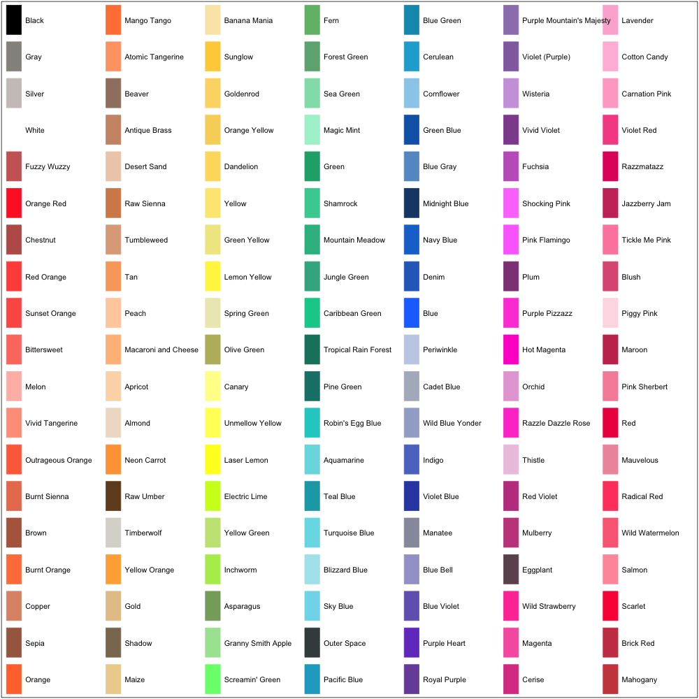

## Crayon colors for javascript

Color crolors based on crayola crayons, taken from
<http://en.wikipedia.org/wiki/List_of_Crayola_crayon_colors>



### Installation

You could grab the file directly from the github repository:
[`crayons.js`](https://raw.githubusercontent.com/kbroman/crayonsJS/master/crayons.js).

Or you could clone the git repository:

```
git clone git://github.com/kbroman/crayonsJS
```

Or, you can use [bower](http://bower.io/):

```
bower install crayons
```

You'll then find the `crayons.js` file in
`bower_components/crayons/crayons.js`.

### Usage

[`crayons.js`](https://github.com/kbroman/crayonsJS/tree/master/crayons.js)
contains just one thing:

- `crayons` &ndash; an object indexed by palette name, containing
  the colors. For example, `crayons["Tickle Me Pink"]`.


### License

Licensed under the [MIT license](License.md). ([More information here](http://en.wikipedia.org/wiki/MIT_License).)
