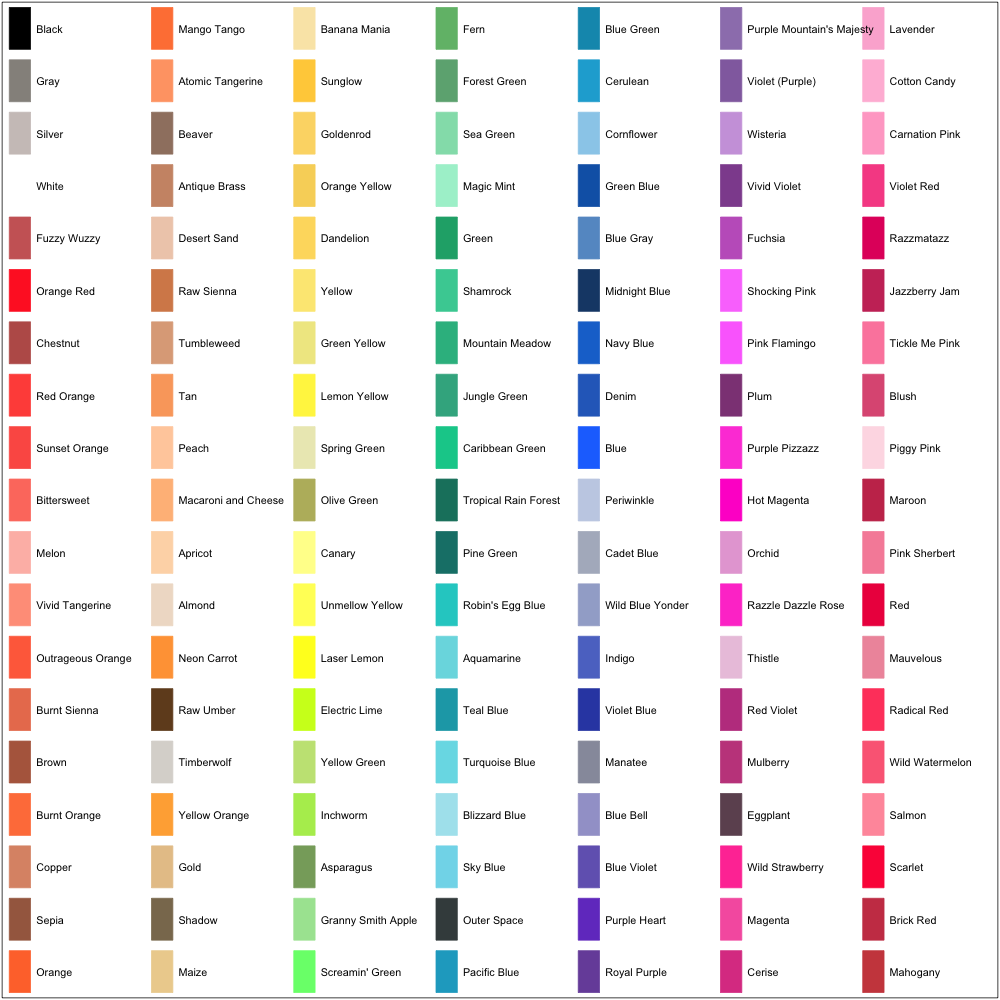

## Crayon colors for javascript

Colors based on crayola crayons, taken from
<http://en.wikipedia.org/wiki/List_of_Crayola_crayon_colors>



### Installation

You could grab the file directly from the github repository:
[`crayons.js`](https://raw.githubusercontent.com/kbroman/crayonsjs/master/crayons.js).

Or you could clone the git repository:

```
git clone git://github.com/kbroman/crayonsjs
```

Or, you can use [bower](http://bower.io/):

```
bower install crayons
```

You'll then find the `crayons.js` file in
`bower_components/crayons/crayons.js`.

You can also link to it directly.

```html
<script type="text/javascript" src="https://kbroman.org/crayons.js"></script>
```

### Usage

[`crayons.js`](https://github.com/kbroman/crayonsjs/tree/main/crayons.js)
contains just one thing:

- `crayons` &ndash; an object, indexed by color name. For example, `crayons["Tickle Me Pink"]`.


### CSS

There's also a CSS version,
[`crayons.css`](https://github.com/kbroman/crayonsjs/main/crayons.css).

Link to it as follows:

```html
<link rel=stylesheet type="text/css" href="https://kbroman.org/crayons.css">
```

It defines a bunch of variables like `--TickleMePink`. Use them as
follows:

```css
body {
    background-color: var(--CottonCandy);
    color: var(--RoyalPurple)
}
```

### License

Licensed under the [MIT license](License.md). ([More information here](http://en.wikipedia.org/wiki/MIT_License).)
